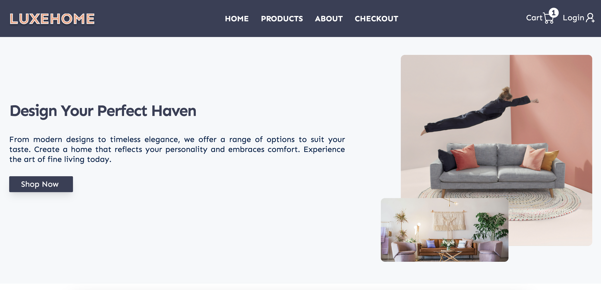

# LuxeHome Furniture Ecommerce Website



## Description

LuxeHome Furniture is an ambitious ecommerce website project designed to offer a luxurious and seamless online shopping experience for furniture enthusiasts. It aims to provide a wide range of features specifically tailored to the furniture industry, including advanced search capabilities, comprehensive product filtering and sorting options, user authentication, secure payment processing, and more. This readme serves as an overview of the project's goals and features, while also acknowledging that active development is still in progress.

## Live Demo

A live demo of the LuxeHome Furniture project is available [here](https://luxehome-ecommerce.netlify.app).

## Technologies Used

The LuxeHome Ecommerce website utilizes the following technologies:

- **React**: The project is built using the React JavaScript library, which provides a powerful and efficient framework for building user interfaces.

- **Tailwind CSS**: Tailwind CSS is a utility-first CSS framework that enables rapid and responsive UI development. It offers a wide range of pre-defined utility classes to style components effectively.

- **Vite**: Vite is a fast and lightweight development tool that enhances the development experience. It offers rapid bundling and hot module replacement, allowing for quick iteration and faster build times.

- **Context API**: The Context API is a feature of React that enables efficient state management and sharing of data between components. It is used in this project to manage and pass data related to user preferences, shopping cart, and other global application state.

- **Axios**: Axios is a JavaScript library used for making HTTP requests from the browser or Node.js. It provides a simple and intuitive API for handling asynchronous requests and responses. In this project, Axios is used for fetching data from external APIs, such as retrieving product information from the John Smilga React Course API.

## Project Inspiration

The idea for the LuxeHome Furniture project originated from John Smilga's React course, which provided invaluable insights and guidance on building robust and feature-rich ecommerce websites using React. LuxeHome Furniture utilizes an API provided by the John Smilga React course to fetch product data, ensuring a realistic and comprehensive showcase of furniture items

## Features

- **Furniture Search**: Users can easily search for specific furniture items using keywords, allowing for quick and targeted product discovery.

- **Advanced Filtering**: The website provides advanced filtering options, including filtering by price range, company, styles, colors, and more. This enables users to narrow down their search results based on specific criteria.

- **Sorting Capabilities**: Users can sort furniture products based on various attributes, such as price, name. Sorting options include sorting by price from high to low or low to high, as well as sorting by name from A to Z or Z to A.

- **User Authentication**: The website incorporates user authentication, allowing users to create accounts, log in, and personalize their shopping experience.

- **Secured Payment Processing**: LuxeHome Ecommerce ensures secure payment processing by integrating with a trusted payment gateway. This enables users to make purchases with confidence, knowing that their payment information is protected.

- **Flexible Cart Management**: The website offers a flexible and intuitive shopping cart management system. Users can add items to their cart, view the contents, modify quantities, remove items, and proceed to checkout seamlessly.

These features combine to create an engaging and user-friendly furniture shopping experience, empowering users to search, filter, sort, authenticate, make secure payments, and manage their shopping carts effectively.

## Screenshots

### Homepage


_Description: The homepage showcases the easy navigation bar and hero section._

### Product Listing Page


_Description: The products page displays a grid of furniture items, allowing users to browse through different categories and explore individual products._

### Featured Page


_Description: The featured product section in the homepage displays few featured products along with a button to explore all the other available products._

### About Page


_Description: The about page provides information about the company's background, values, and mission, giving users insight into the brand's story._

### Company's Vision, Goal, and Subscription Page


_Description: This section of the homepage presents the company's vision and goals, along with a subscription option for users to receive updates, promotions, and special offers._

## Installation

To run the LuxeHome Ecommerce website locally, follow these steps:

1. Clone the repository:

   ```
   git clone https://github.com/pradeepkhanal23/luxehome-ecommerce.git
   ```

2. Navigate to the project directory:

   ```
   cd luxehome-ecommerce
   ```

3. Install the dependencies:

   ```
   npm install
   ```

4. Start the development server:

   ```
   npm run dev
   ```

5. Open your browser and visit `http://localhost:3000` to view the website.

## Roadmap

The LuxeHome Ecommerce project is still under development. Future enhancements and features planned for implementation include:

- User authentication and account management
- Integration with a payment gateway for secure online transactions
- Wishlist functionality for users to save desired products
- Enhanced product recommendation system
- Order history and tracking functionality
- Responsive design for optimal viewing across different devices

## License

This project is licensed under the [MIT License](LICENSE).
